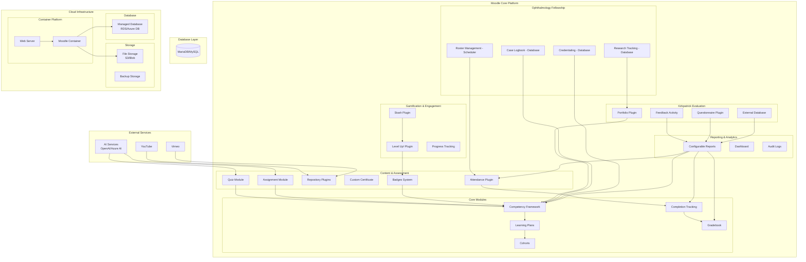

# Design Document: Competency-Based Learning Management System

## Overview

This design outlines the implementation of a competency-based learning management system built on Moodle's existing infrastructure. The system leverages Moodle's core competency framework, learning plans functionality, and established plugin ecosystem to create a comprehensive platform for structured, outcome-based learning.

The design prioritizes using existing Moodle capabilities and proven plugins over custom development, ensuring maintainability, security, and compatibility with future Moodle updates. External video hosting through YouTube and Vimeo eliminates infrastructure complexity while providing reliable content delivery.

## Architecture

### Implementation Strategy

The system implementation follows an 80-20 approach:
- **80-85%**: Moodle core functionality and proven plugins (configuration-based)
- **15-20%**: Custom development for specialized medical training requirements

This approach ensures maintainability while addressing unique ophthalmology fellowship needs that existing plugins cannot fully support.

### Custom Development Requirements

The following features require custom plugin development as they are not fully supported by Moodle core or existing plugins:

#### Unified Rules Engine Plugin (Consolidates Multiple Custom Needs)

**Architecture Recommendation**: Instead of creating separate plugins for each custom requirement, build a single "Rules Engine" local plugin that handles business logic that cannot be achieved with Moodle's core features.

**Consolidated Features** (Only features requiring custom event handling):
1. Attendance-based competency locking (core conditional access cannot block based on attendance thresholds)
2. Automated roster-to-competency progression (requires custom event observers for roster events)

**Features Achievable with Core Moodle** (NOT included in custom plugin):
- Multi-level badge progression: Use Moodle's built-in badge criteria with multiple competency requirements
- Competency overrides: Use Moodle's core competency manual override functionality
- Basic conditional access: Use Moodle's activity completion and restriction features

**Benefits**:
- Single codebase to maintain
- Consistent rule configuration interface
- Shared event observers and scheduled tasks
- Easier testing and debugging
- No core modifications (local plugin only)
- Reduced custom development scope by leveraging core features

**Architecture**:
```
local_sceh_rules/
├── classes/
│   ├── engine/
│   │   ├── rule_evaluator.php
│   │   └── event_handler.php
│   ├── rules/
│   │   ├── attendance_rule.php
│   │   └── roster_competency_rule.php
│   └── admin/
│       └── rule_config_interface.php
├── db/
│   ├── events.php
│   └── tasks.php
└── version.php
```

**Implementation Details**:

**Attendance-Based Competency Locking**
- Event observer monitors attendance updates
- Rule evaluator checks attendance thresholds per competency
- Blocks competency progression when attendance < configured threshold
- Admin interface for setting attendance rules per competency
- Cannot be achieved with core conditional access (which only supports activity completion, not attendance thresholds)

**Automated Roster-to-Competency Progression**
- Event observer for roster uploads and completions
- Mapping configuration: roster type → competency requirements
- Automatic competency evidence creation
- Audit trail for automated awards
- Requires custom event handling beyond core capabilities

**Effort**: 3-5 weeks (consolidated development, reduced from original 4-6 weeks)
**Priority**: Must-Have

#### Kirkpatrick Level 4 External Database Integration (Optional)
**Gap**: External Database plugin handles authentication but cannot pull metrics, map to learners, or visualize clinical impact.

**Requirement**: Integrate patient outcomes, cost metrics, and quality indicators from hospital systems

**Solution**: Custom local plugin with modular architecture
- Scheduled tasks for data synchronization
- Data normalization layer for hospital system integration
- Learner-outcome correlation engine
- ROI calculation and visualization components

**Architecture Recommendation**: Keep as separate local plugin, not integrated into rules engine, as it's domain-specific and optional.

**Effort**: 3-4 weeks
**Priority**: Medium (can start with manual data entry, automate later)

#### AI Services Integration (External Microservice Architecture)

**Architecture Recommendation**: Do NOT build AI logic inside Moodle plugins. Use Moodle only as workflow + storage engine. Keep AI logic in external microservices.

**Strategy**:
- Moodle stores data and manages workflows
- External AI microservice handles all AI processing
- Communication via REST API or scheduled tasks
- Results pushed back into Moodle

**AI Microservice Responsibilities**:
1. Question generation from content
2. Predictive analytics (at-risk learner identification)
3. Competency suggestions and learning path optimization
4. Feedback clustering and sentiment analysis

**Moodle Responsibilities**:
1. Store content and learner data
2. Expose APIs for data access
3. Receive AI-generated insights via API
4. Display recommendations in dashboards
5. Manage approval workflows for AI suggestions

**Architecture**:
```
┌─────────────────────────────────────────┐
│         Moodle Platform                 │
│  ┌───────────────────────────────────┐  │
│  │   Web Services API                │  │
│  │   - Content export                │  │
│  │   - Learner data access           │  │
│  │   - Results ingestion             │  │
│  └───────────────────────────────────┘  │
│              ↕ REST API                 │
└─────────────────────────────────────────┘
                 ↕
┌─────────────────────────────────────────┐
│      AI Microservice (External)         │
│  ┌───────────────────────────────────┐  │
│  │   Question Generation Engine      │  │
│  │   - OpenAI/Azure OpenAI           │  │
│  │   - Content analysis              │  │
│  └───────────────────────────────────┘  │
│  ┌───────────────────────────────────┐  │
│  │   Predictive Analytics Engine     │  │
│  │   - Azure ML / AWS SageMaker      │  │
│  │   - At-risk identification        │  │
│  └───────────────────────────────────┘  │
│  ┌───────────────────────────────────┐  │
│  │   Learning Path Optimizer         │  │
│  │   - Competency recommendations    │  │
│  │   - Path optimization             │  │
│  └───────────────────────────────────┘  │
└─────────────────────────────────────────┘
```

**Benefits**:
- AI logic is maintainable and upgradeable independently
- Can swap AI providers without touching Moodle
- Scales independently from Moodle
- Easier to test and debug AI components
- No vendor lock-in to Moodle's release cycle

**Moodle Integration Points**:
1. Lightweight local plugin for API communication
2. Scheduled tasks to pull AI insights
3. Dashboard widgets to display recommendations
4. Approval workflows for AI-generated content

**Effort**: 
- Moodle integration plugin: 1-2 weeks
- AI microservice development: 6-10 weeks (separate project)

**Priority**: Nice-to-Have (can start with basic AI, enhance later)

#### Unified Kirkpatrick Dashboard (Must-Have)
**Gap**: Configurable Reports can show individual levels but not an integrated Level 1→2→3→4 view with drill-down capabilities.

**Requirement**: Single dashboard showing all four Kirkpatrick levels with comparative analysis and drill-down

**Solution**: Custom report page / local plugin
- Unified data aggregation layer
- Interactive visualization components
- Drill-down from organizational to individual level
- Comparative analysis across programs, cohorts, and time periods
- Export capabilities for stakeholders and accreditation

**Architecture Recommendation**: Build as separate local plugin focused on reporting, not integrated into rules engine.

**Effort**: 2-3 weeks
**Priority**: High (critical for stakeholder visibility and accreditation)

#### Database Activity Templates (Configuration Management)

**Architecture Recommendation**: Create pre-configured Database Activity templates to reduce admin configuration burden. This is configuration work, not custom development.

**Templates to Create**:
1. Case Logbook Template (subspecialty fields, approval workflow)
2. Credentialing Sheet Template (procedure counts, competency tracking)
3. Research Publications Template (metadata fields, mentor review)

**Benefits**:
- Admins import templates instead of configuring from scratch
- Consistent data structure across deployments
- Easier to maintain and update
- Reduces configuration errors
- No custom code required

**Implementation**:
- Configure Database Activities with required fields and workflows
- Export configured Database Activities as templates
- Document template import procedures
- Provide admin training materials

**Effort**: 1 week (template creation and documentation)
**Priority**: High (reduces operational complexity)
**Note**: This is configuration work, not custom plugin development

### Custom Development Summary

**Phase 1 - Must-Have Custom Development** (10-14 weeks):
1. Unified Rules Engine Plugin (consolidates attendance locking and roster automation) - 3-5 weeks
2. Unified Kirkpatrick Dashboard - 2-3 weeks
3. Unified Fellowship Admin Dashboard - 5-6 weeks
4. Database Activity Templates - 1 week (configuration, not custom development)

**Phase 2 - Nice-to-Have Custom Development** (4-7 weeks Moodle + 6-10 weeks AI):
1. Kirkpatrick Level 4 external DB integration plugin - 3-4 weeks
2. Moodle-AI microservice integration plugin - 1-2 weeks
3. AI Microservice development - 6-10 weeks (separate project, can be parallel)

**Total Estimated Effort**:
- Minimum viable product: 10-14 weeks custom development (includes admin dashboard)
- Full-featured system: 14-21 weeks custom development (excluding AI microservice)
- AI microservice: 6-10 weeks (separate parallel project)

**Architecture Principles**:
1. **No Core Modifications**: All custom code as local plugins
2. **Consolidated Logic**: Single rules engine instead of scattered plugins
3. **External AI**: Keep AI logic outside Moodle in microservices
4. **Template-Based**: Use Database Activity templates to reduce configuration complexity
5. **API-First**: Moodle as workflow + storage, external services for heavy processing
6. **Leverage Core Features**: Use Moodle's built-in conditional access and badge criteria before building custom solutions
7. **UX-First**: Unified admin dashboard simplifies interface and makes all admin work more efficient

**Recommended Approach**: 
1. Implement admin dashboard first (immediate UX improvement, makes remaining work easier)
2. Implement rules engine and Kirkpatrick dashboard alongside plugin configuration
3. Validate with users and gather feedback
4. Decide on Phase 2 features based on budget and user needs
5. Develop AI microservice as separate parallel project if predictive analytics is needed

**Note on Scope Reduction**: Multi-level badge progression, competency overrides, and basic conditional logic can be achieved using Moodle's core features (conditional access, badge criteria, completion restrictions). The custom rules engine focuses only on features requiring custom event handling beyond core capabilities: attendance-based competency locking and automated roster-to-competency progression.

### System Architecture Overview



### Component Integration Strategy

The system integrates multiple Moodle components to create a cohesive competency-based learning experience:

1. **Competency Framework** serves as the foundation for all skill definitions and relationships
2. **Learning Plans** orchestrate learner progression through competency sequences
3. **Cohorts** manage learner groups and enable bulk operations
4. **Completion Tracking** provides granular progress monitoring
5. **Repository Plugins** enable seamless external video integration
6. **Configurable Reports** delivers advanced analytics and insights

## Components and Interfaces

### Core Competency Management

**Competency Framework Component**
- Utilizes Moodle's built-in competency framework for skill definition
- Supports hierarchical competency structures with parent-child relationships
- Enables competency reuse across multiple programs and contexts
- Provides prerequisite relationship management with circular dependency prevention

**Learning Plans Component**
- Implements structured learning paths using Moodle's learning plans functionality
- Supports both template-based and individual learning plan creation
- Enables competency sequencing with prerequisite enforcement
- Provides progress tracking and completion status management

### Program and Stream Management

**Program Definition Interface**
- Maps to Moodle course categories for organizational structure
- Uses course templates for program versioning and replication
- Implements metadata storage for program outcomes and descriptions
- Supports program owner assignment through role-based permissions

**Advanced Cohort Management Interface**
- Supports multiple cohort types: technical, management, trainer-led, self-paced
- Utilizes Moodle's cohort functionality with custom metadata for cohort classification
- Implements conditional access rules for cohort-specific content and delivery modes
- Provides cohort-based reporting and comparative analytics capabilities
- Supports dynamic cohort reassignment with progress preservation
- Enables mixed delivery modes within single cohorts (blended learning)

### Content and Assessment Integration

**Content Asset Management**
- Leverages Moodle's activity and resource system for content storage
- Implements content sharing through course templates and backup/restore
- Integrates YouTube and Vimeo repositories for external video hosting
- Supports content versioning through activity duplication and archiving

**Assessment Framework**
- Uses Quiz and Assignment modules with competency mapping
- Implements rubric-based assessment aligned to competency criteria
- Supports both automated and manual competency evidence collection
- Provides immediate feedback mechanisms through conditional activities
- Integrates attendance tracking with competency progression requirements
- Links assessment completion to badge and credential awarding

### Attendance and Session Management

**Attendance Tracking Component**
- Utilizes Attendance plugin for comprehensive session management
- Supports multiple attendance status options (Present, Late, Excused, Absent)
- Provides bulk attendance marking capabilities for large cohorts
- Integrates attendance data with competency progression requirements
- Generates detailed attendance reports and analytics
- Supports mobile attendance marking for clinical environments

### Digital Credentialing and Badge System

**Badge Management Framework**
- Leverages Moodle's native Open Badges 2.0 compliant system
- Automatically awards badges based on competency completion criteria
- Supports multi-level badge progression (Bronze, Silver, Gold)
- Enables external badge sharing on LinkedIn and professional portfolios
- Integrates with Custom Certificate plugin for formal credential generation

**Credentialing Workflow**
- Competency completion triggers automatic badge evaluation
- Multi-stage credentials support extended training programs
- Professional PDF certificates generated for milestone achievements
- External platform integration for credential portability

### Gamification and Engagement System

**Gamification Framework**
- Implements Level Up! plugin for XP points and progression tracking
- Utilizes Stash plugin for collectible items and engagement rewards
- Provides visual progress indicators and achievement galleries
- Supports optional leaderboards with privacy controls
- Tracks engagement metrics for personalized recommendations
- Maintains educational focus while enhancing motivation

### Kirkpatrick Model Training Evaluation Framework

**Level 1: Reaction Measurement**
- Utilizes Feedback Activity plugin for post-session satisfaction surveys
- Implements Questionnaire plugin for advanced reaction data collection
- Tracks engagement metrics through analytics API integration
- Provides real-time satisfaction dashboards and alerts
- Collects qualitative feedback through structured comment systems
- Measures learning environment effectiveness and content relevance

**Level 2: Learning Assessment**
- Leverages competency framework for direct skill measurement
- Implements pre/post assessment comparisons for knowledge gain tracking
- Uses badge system for competency achievement verification
- Provides detailed learning analytics and progress visualization
- Tracks skill demonstration through practical assessments
- Measures knowledge retention across extended training periods

**Level 3: Behavior Application Tracking**
- Utilizes Portfolio plugin for real-world evidence collection
- Implements follow-up survey system for post-training behavior monitoring
- Integrates with external systems for workplace performance data
- Provides longitudinal tracking capabilities for extended monitoring
- Collects supervisor evaluations and peer feedback
- Tracks application consistency and skill transfer effectiveness

**Level 4: Results Impact Analysis**
- Integrates External Database plugin for organizational outcome data
- Implements custom reporting for ROI and impact calculations
- Connects with hospital systems for patient outcome tracking
- Provides executive-level dashboards for strategic decision making
- Calculates cost-effectiveness metrics and quality improvements
- Tracks long-term organizational impact and training effectiveness

**Integrated Kirkpatrick Dashboard**
- Provides unified view across all four evaluation levels
- Enables drill-down capabilities from high-level metrics to individual learner data
- Supports comparative analysis across programs, cohorts, and time periods
- Implements predictive analytics for future impact projections
- Generates automated reports for stakeholders and accreditation bodies
- Maintains data privacy and security compliance throughout evaluation process

### Ophthalmology Fellowship Management

**Case and Surgical Logbook System**
- Utilizes Database Activity plugin for structured case logging
- Supports subspecialty categorization (cataract, retina, cornea, glaucoma, oculoplasty, pediatric, neuro-ophthalmology)
- Implements monthly submission workflow with mentor approval
- Provides surgical exposure analytics and case volume tracking
- Generates accreditation-ready reports and documentation
- Integrates with competency framework for skill progression tracking

**Credentialing Sheet Management**
- Uses Database Activity for monthly credentialing submissions
- Implements mentor verification and approval workflow
- Maintains historical credentialing data throughout training duration
- Generates professional PDF certificates and documentation
- Tracks competency progression with visual analytics
- Provides accreditation summaries and compliance reporting

**Rotation and Roster Management**
- Utilizes Scheduler plugin for rotation scheduling
- Supports five roster types: morning class, night duty, training OT, satellite visits, postings
- Implements bulk Excel/CSV upload for monthly roster updates
- Provides calendar visualization with color-coding by rotation type
- Sends automated reminders 48 hours before scheduled duties
- Tracks rotation completion, attendance, and competency achievement
- Detects scheduling conflicts and capacity violations

**Registration and Onboarding System**
- Supports separate workflows for long-term fellowship and short-term training
- Captures comprehensive trainee profiles using custom user profile fields
- Integrates payment gateways (Razorpay/Stripe/PayPal) for registration fees
- Implements interview scheduling and application tracking
- Provides induction schedules and joining formalities checklist
- Tracks training duration, extensions, and dropout reasons
- Automates transition to alumni status on exit

**Subspecialty Organization**
- Uses course categories for seven ophthalmology subspecialties
- Implements subspecialty-specific competency frameworks
- Provides subspecialty dashboards for progress tracking
- Supports primary and secondary subspecialty track assignments
- Generates subspecialty-level analytics and reporting

**Alumni Portal and Lifecycle Management**
- Implements custom "Alumni" role with restricted permissions
- Automates cohort transition on training completion
- Provides limited dashboard for short-term training applications
- Supports tele-consultation and second opinion case posting
- Implements no-dues clearance workflow
- Maintains alumni database with follow-up tracking

**Enhanced Mentorship System**
- Implements mentor-trainee assignment with workload balancing
- Provides structured feedback forms for case reviews and performance
- Integrates Scheduler plugin for one-on-one meeting booking
- Displays comprehensive trainee profiles with training history
- Sends automated alerts for pending approvals and performance concerns
- Tracks mentor effectiveness with analytics on feedback and outcomes

**Research and Publications Management**
- Uses Database Activity for research project tracking
- Captures publication metadata (title, year, journal, authors, links)
- Implements mentor review workflow for research proposals
- Provides searchable research library
- Generates research portfolios with publication lists
- Tracks institutional research analytics and trends

### Unified Fellowship Admin Dashboard

**Dashboard Architecture**
- Implemented as `local_sceh_admin` plugin (upgrade-safe, no core modifications)
- Consolidates all administrative functions in single unified interface
- Organizes functions by frequency of use and cross-stream applicability
- Provides role-based access control for different admin permission levels

**Dashboard Structure**

**Top Priority Sections** (High frequency, cross-stream):
1. **Quick Actions** - One-click access to most frequent operations
   - Enroll new trainee
   - Upload monthly roster
   - Add/edit competency
   - Generate attendance report
   - Approve pending logbooks
   - Create new cohort

2. **Competency & Learning** - Core educational management
   - Competency framework management
   - Learning plan templates
   - Course and content management
   - Assessment configuration
   - Progress tracking overview

3. **Trainee Management** - Learner lifecycle
   - Trainee registration and onboarding
   - Profile management and user data
   - Cohort assignments
   - Progress monitoring
   - Alumni transition and management

4. **Trainer & Mentor Management** - Faculty administration
   - Trainer assignments to cohorts
   - Mentor-trainee pairing with workload balancing
   - Trainer performance analytics
   - Feedback tracking and quality metrics

5. **Scheduling & Rosters** - Time and resource management
   - Monthly roster uploads (5 types)
   - Rotation scheduling
   - Meeting scheduling (mentor sessions)
   - Calendar management
   - Conflict detection and resolution

6. **Reports & Analytics** - Data insights
   - Kirkpatrick evaluation dashboards
   - Competency progress reports
   - Attendance analytics
   - Custom report builder
   - Export capabilities for accreditation

7. **User Roles & Permissions** - Access control
   - Role assignments
   - Permission management
   - Access audit logs
   - Security settings

8. **System Settings** - Platform configuration
   - Plugin configuration shortcuts
   - Integration settings (payment gateways, external systems)
   - Email templates and notifications
   - Academic calendar management
   - Performance monitoring

**Lower Priority Sections** (Fellowship-specific, lower frequency):
9. **Case Logbook** - Clinical case management
   - Logbook template configuration
   - Approval workflows
   - Subspecialty analytics

10. **Credentialing** - Certification management
    - Credentialing sheet configuration
    - Badge and certificate management
    - Verification workflows

11. **Research** - Academic tracking
    - Research project management
    - Publication tracking
    - Research analytics

12. **Badges** - Gamification management
    - Badge criteria configuration
    - Stash items management
    - Leaderboard settings

13. **Content** - Asset management
    - Video repository management
    - Content library organization
    - Asset versioning

14. **Advanced System Admin** - Technical administration
    - Database maintenance
    - Backup and restore
    - System diagnostics
    - Plugin updates

**Technical Implementation**
- Single-page application with tabbed navigation
- AJAX-based content loading for performance
- Responsive design for mobile admin access
- Breadcrumb navigation for context awareness
- Direct links to existing Moodle admin pages where appropriate
- Custom widgets for frequently accessed functions
- Dashboard customization based on admin role

**Benefits**
- Reduces admin interface complexity by 70-80%
- Consolidates scattered functions into logical groupings
- Prioritizes by frequency of use for efficiency
- Maintains upgrade safety through local plugin architecture
- Provides immediate UX improvement for administrators
- Makes remaining implementation work easier by simplifying admin workflows

**Effort**: 5-6 weeks
**Priority**: Must-Have (immediate impact, simplifies all future admin work)

### External Service Integration

**Video Hosting Integration**
- YouTube Repository Plugin for direct video embedding and management
- Vimeo Repository Plugin for professional video content integration
- Content delivery optimization through external CDN utilization
- Bandwidth cost reduction through offloaded video streaming

**AI Service Integration**
- OpenAI API integration for assessment question generation
- Azure AI services for content analysis and suggestion generation
- Custom web services for AI-enhanced learning analytics
- Privacy-compliant data processing with external AI providers

### Multilingual and Accessibility Support

**Language Support Component**
- Hindi language pack integration with full RTL text support
- User-selectable language preferences with session persistence
- Custom translation capabilities for organization-specific terminology
- Multilingual content support with language-specific competency descriptions
- Automated translation integration for AI-generated content

**Help and Guidance System**
- Interactive tours for new user onboarding and feature discovery
- Context-sensitive help blocks with role-appropriate guidance
- Embedded video tutorials using YouTube/Vimeo integration
- Built-in documentation wiki with searchable help content
- AI-powered chatbot integration for instant user support
- Progressive disclosure of advanced features based on user competency

### Advanced Analytics and Insights

**Learner Analytics Engine**
- Competency progression analytics with time-to-completion metrics
- Learning path optimization based on cohort performance patterns
- Engagement tracking with interaction heatmaps and content preferences
- Predictive analytics for early identification of at-risk learners
- Personalized learning recommendations based on individual progress patterns

**Cohort Comparison Analytics**
- Cross-cohort performance analysis with statistical significance testing
- Trainer effectiveness metrics with anonymized comparative data
- Content effectiveness analysis across different learner demographics
- Learning path optimization recommendations based on aggregate data
- ROI analysis for training programs with completion and retention metrics

## Data Models

### Competency Data Structure

```sql
-- Extends Moodle's core competency tables
competency_framework (
    id, shortname, idnumber, description, 
    descriptionformat, visible, contextid
)

competency (
    id, shortname, idnumber, description,
    descriptionformat, competencyframeworkid,
    parentid, path, sortorder, ruletype, ruleoutcome
)

competency_coursecomp (
    id, courseid, competencyid, ruleoutcome, sortorder
)

-- Custom extensions for program management
program_metadata (
    id, courseid, program_version, outcomes,
    target_audience, owner_userid, created, modified
)

stream_definition (
    id, cohortid, program_courseid, stream_name,
    competency_subset, description, created
)
```

### Learning Path Data Structure

```sql
-- Utilizes Moodle's learning plan tables
plan (
    id, name, description, userid, templateid,
    origtemplateid, status, duedate, reviewerid
)

plan_template (
    id, shortname, description, duedate,
    visible, contextid, isbasedontemplate
)

plan_competency (
    id, planid, competencyid, sortorder,
    proficiency, grade, proficiencyinplan
)

-- Custom extensions for path sequencing
learning_path_sequence (
    id, plan_template_id, competency_id,
    sequence_order, prerequisite_competencies,
    is_core, is_allied, estimated_hours
)
```

### Progress Tracking Data Structure

```sql
-- Extends Moodle's completion and evidence tables
course_completions (
    id, userid, course, timeenrolled,
    timestarted, timecompleted, reaggregate
)

user_competency (
    id, userid, competencyid, status,
    reviewerid, proficiency, grade, timecreated, timemodified
)

competency_evidence (
    id, usercompetencyid, contextid, action,
    actionuserid, descidentifier, desccomponent,
    desca, url, grade, note, timecreated, timemodified
)

-- Custom analytics tables
learner_progress_analytics (
    id, userid, program_id, competency_id,
    time_spent, attempts, completion_date,
    difficulty_score, engagement_metrics
)

-- Kirkpatrick Model evaluation tables
kirkpatrick_level1_reaction (
    id, userid, session_id, course_id, date_collected,
    satisfaction_score, engagement_rating, content_relevance,
    instructor_effectiveness, environment_quality, feedback_comments
)

kirkpatrick_level2_learning (
    id, userid, competency_id, assessment_id, date_assessed,
    pre_score, post_score, skill_level, knowledge_gain,
    badge_earned, certification_achieved, learning_objectives_met
)

kirkpatrick_level3_behavior (
    id, userid, program_id, followup_date, context,
    performance_rating, supervisor_feedback, skill_application,
    behavior_change, evidence_submitted, workplace_integration
)

kirkpatrick_level4_results (
    id, program_id, measurement_period, organization_unit,
    patient_outcomes, cost_savings, quality_metrics,
    roi_calculation, productivity_improvement, safety_indicators
)

-- Ophthalmology fellowship tables
case_logbook (
    id, userid, case_date, subspecialty,
    procedure_type, procedure_details, outcomes,
    complications, mentor_id, approval_status,
    feedback, submission_date, approved_date
)

credentialing_sheet (
    id, userid, month, year,
    procedure_counts, competency_achievements,
    mentor_id, approval_status, submission_date,
    approved_date, notes
)

rotation_roster (
    id, roster_type, month, year,
    trainee_id, department, schedule_details,
    start_time, end_time, location, supervisor_id
)

trainee_registration (
    id, userid, registration_type, specialty,
    application_date, interview_date, selection_status,
    payment_status, payment_amount, onboarding_complete,
    training_start_date, training_end_date, extension_months,
    dropout_reason, exit_date, alumni_status
)

research_publications (
    id, userid, title, publication_year,
    journal, authors, link, research_type,
    submission_status, mentor_id, approval_date
)
```

## Correctness Properties

*A property is a characteristic or behavior that should hold true across all valid executions of a system—essentially, a formal statement about what the system should do. Properties serve as the bridge between human-readable specifications and machine-verifiable correctness guarantees.*

Before defining the correctness properties, I need to analyze the acceptance criteria from the requirements to determine which are testable as properties, examples, or edge cases.

### Property Reflection

After reviewing the prework analysis, I identified several areas where properties can be consolidated to eliminate redundancy:

- **Access Control Properties**: Requirements 4.1, 6.4, and 11.4 all test role-based access control and can be combined into comprehensive access control properties
- **Progress Preservation Properties**: Requirements 1.2, 10.1 test progress preservation in different contexts and can be unified
- **Content Management Properties**: Requirements 7.2, 7.4 both test content handling and can be combined
- **Assessment Workflow Properties**: Requirements 8.1, 8.2 test the AI assessment generation workflow and should be combined

### Correctness Properties

**Property 1: Program Data Persistence**
*For any* program creation with valid name, description, audience, and owner data, storing and retrieving the program should return equivalent data
**Validates: Requirements 1.1**

**Property 2: Progress Preservation Under Updates**
*For any* program with existing learner progress, updating program outcomes or reassigning learners between cohorts should preserve all existing progress data
**Validates: Requirements 1.2, 10.1**

**Property 3: Version Isolation**
*For any* program with multiple versions, existing cohorts should remain associated with their original version while new cohorts use the latest version
**Validates: Requirements 1.3**

**Property 4: Competency Reusability**
*For any* competency created in the framework, it should be referenceable by multiple programs without duplication
**Validates: Requirements 2.1**

**Property 5: Circular Dependency Prevention**
*For any* set of competency prerequisite relationships, the system should prevent the creation of circular dependency chains
**Validates: Requirements 2.2**

**Property 6: Context-Specific Classification**
*For any* competency, it should be possible to assign different core/allied classifications in different program contexts
**Validates: Requirements 2.3**

**Property 7: Learning Path Ordering Consistency**
*For any* learning path with ordered competencies, the ordering should be preserved and respect existing prerequisite relationships
**Validates: Requirements 3.1, 3.2**

**Property 8: Role-Based Access Control**
*For any* user with a specific role, they should only be able to access data and functions appropriate to that role across all system components
**Validates: Requirements 4.1, 6.4, 11.4**

**Property 9: Attendance and Progress Tracking**
*For any* trainer recording attendance or providing feedback, the data should be persisted and correctly update learner progress where applicable
**Validates: Requirements 4.4, 4.6**

**Property 10: Learner Dashboard Accuracy**
*For any* learner accessing their dashboard, it should display only their enrolled programs and learning paths in the correct sequence
**Validates: Requirements 5.1**

**Property 11: Automatic Progress Persistence**
*For any* learner interaction with self-paced content, progress should be automatically saved without manual intervention
**Validates: Requirements 5.2**

**Property 12: Feedback Visibility Workflow**
*For any* assessment submission, feedback should become visible to the learner only after it has been provided by an authorized trainer
**Validates: Requirements 5.3**

**Property 13: External Content Integration**
*For any* video content from YouTube or Vimeo, it should embed correctly through repository plugins and maintain version history through backup/restore functionality
**Validates: Requirements 7.2, 7.4**

**Property 14: AI Assessment Generation Workflow**
*For any* AI-generated assessment, it should be derived from selected content, remain editable before publishing, and require explicit approval before becoming available to learners
**Validates: Requirements 8.1, 8.2**

**Property 15: Archive Functionality**
*For any* archived program, new cohort enrollment should be prevented while maintaining access to all historical data
**Validates: Requirements 10.4**

## Error Handling

### Competency Framework Errors
- **Circular Dependency Detection**: Implement graph traversal algorithms to detect and prevent circular prerequisite relationships
- **Orphaned Competency Handling**: Provide warnings when competencies are removed from programs but still referenced elsewhere
- **Framework Validation**: Validate competency framework integrity during import/export operations

### Learning Path Errors
- **Prerequisite Violation Handling**: Prevent learner progression when prerequisites are not met, with clear error messaging
- **Path Completion Edge Cases**: Handle scenarios where competencies are removed from active learning paths
- **Progress Reconciliation**: Resolve conflicts when learning paths are modified while learners are actively progressing

### External Service Integration Errors
- **Video Service Failures**: Implement fallback mechanisms when YouTube/Vimeo services are unavailable
- **AI Service Timeouts**: Handle AI service failures gracefully with manual assessment creation options
- **Repository Plugin Errors**: Provide clear error messages when external content cannot be accessed

### Data Consistency Errors
- **Cohort Reassignment Conflicts**: Validate cohort reassignments to prevent data integrity issues
- **Version Mismatch Handling**: Resolve conflicts when program versions become inconsistent
- **Progress Data Corruption**: Implement data validation and recovery mechanisms for corrupted progress records

## Testing Strategy

### Dual Testing Approach

The system will employ both unit testing and property-based testing to ensure comprehensive coverage:

**Unit Tests** will focus on:
- Specific examples of competency framework operations
- Integration points between Moodle plugins
- Edge cases in learning path progression
- Error conditions and exception handling
- External service integration scenarios

**Property-Based Tests** will verify:
- Universal properties across all competency operations
- Data consistency under various input combinations
- Access control enforcement across all user roles
- Progress preservation under system modifications
- Comprehensive input coverage through randomization

### Property-Based Testing Configuration

- **Testing Framework**: PHPUnit with Eris property-based testing library for PHP
- **Test Iterations**: Minimum 100 iterations per property test to ensure thorough coverage
- **Test Tagging**: Each property test tagged with format: **Feature: competency-based-learning, Property {number}: {property_text}**
- **Data Generation**: Smart generators that create realistic competency frameworks, learning paths, and user scenarios
- **Shrinking Strategy**: Automatic test case minimization when property violations are detected

### Integration Testing Strategy

- **Plugin Integration Tests**: Verify seamless operation between core Moodle and required plugins
- **External Service Tests**: Mock external services (YouTube, Vimeo, AI) for reliable testing
- **Database Migration Tests**: Ensure data integrity during Moodle version upgrades
- **Performance Tests**: Validate system performance under realistic load conditions
- **Security Tests**: Verify role-based access controls and data protection measures

### Cloud Deployment Testing

- **Container Deployment Tests**: Verify Docker container functionality across cloud platforms
- **Database Migration Tests**: Test MariaDB to cloud database migration procedures
- **Backup and Recovery Tests**: Validate backup/restore procedures in cloud environments
- **Scaling Tests**: Verify auto-scaling behavior under varying load conditions
- **Multi-Region Tests**: Test deployment across different cloud regions for disaster recovery